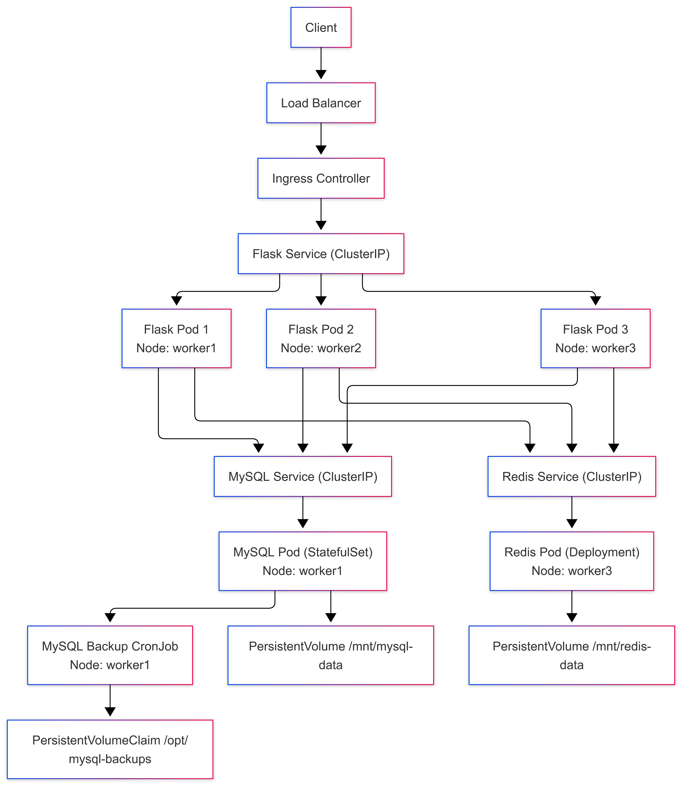

# Employees Data Application - Helm (Kubernetes – Dev Environment)

This repository contains a **Helm-based Kubernetes application stack** consisting of a Flask web application, a MySQL database, and Redis for caching.

It is designed to be deployed **on top of an existing Kubernetes cluster** that is provisioned and configured using the following infrastructure repository:

[https://github.com/Sreevas-MK/k8s-dev-infra.git](https://github.com/Sreevas-MK/k8s-dev-infra.git)

This repository focuses **only on application-level manifests and configuration**, while cluster creation, ingress controller installation, monitoring, and GitOps tooling are handled externally.

<p align="center">
  
</p>

---

## Purpose of This Repository

This project represents a **realistic development-grade Kubernetes application** with:

* Stateless application pods
* Stateful database and cache
* Persistent storage using hostPath
* Scheduled database backups
* Autoscaling (HPA & VPA)
* Ingress-based traffic routing

It is intentionally kept **simple, explicit, and readable** to support learning and experimentation.

## Application Source Code Repository

The Flask application deployed by this Helm chart is maintained in a separate source repository:
https://github.com/Sreevas-MK/employees-data-app.git

---
## Repository Structure

```
.
├── Chart.yaml
├── namespace.yml
├── values.yaml
├── templates
│   ├── flask-deployment
│   │   ├── README.md
│   │   ├── flask-app-deployment.yml
│   │   ├── flask-app-hpa.yml
│   │   ├── flask-app-service.yml
│   │   └── flask-ingress.yml
│   ├── mysql-statefulset
│   │   ├── README.md
│   │   ├── mysql-statefulset.yml
│   │   ├── mysql-service.yml
│   │   ├── mysql-configmap.yml
│   │   ├── mysql-secrets.yml
│   │   ├── mysql-pv.yml
│   │   ├── mysql-pvclaim.yml
│   │   ├── mysql-backup-cron.yml
│   │   ├── mysql-backup-pv.yml
│   │   ├── mysql-backup-pvclaim.yml
│   │   └── mysql-vpa.yml
│   └── redis-deployment
│       ├── README.md
│       ├── redis-deployment.yml
│       ├── redis-configmap.yml
│       ├── redis-pv.yml
│       ├── redis-pvclaim.yml
│       ├── redis-service.yml
│       └── redis-vpa.yml
```

Each major component has its **own README** explaining internal details.

---
## Application Components

### Flask Application

* Deployed as a Kubernetes **Deployment**
* Horizontally scalable using **HPA**
* Exposed internally via a ClusterIP Service
* Traffic routed through **Traefik Ingress**
* Connects to MySQL and Redis using service DNS

### MySQL

* Deployed as a **StatefulSet**
* Uses **headless + normal services**
* Persistent storage via **hostPath-backed PV**
* Scheduled backups using a **CronJob**
* Resource tuning via **Vertical Pod Autoscaler**

### Redis

* Deployed as a **Deployment**
* Persistent storage enabled (AOF mode)
* Node-pinned using affinity
* Resource tuning via **Vertical Pod Autoscaler**

---
## Values Configuration (`values.yaml`)

All environment-specific behavior is controlled via `values.yaml`, including:

* Namespace
* Image versions
* Resource limits
* Autoscaling parameters
* Storage paths
* Node selectors
* Backup schedules
* Ingress hostnames

This allows the same chart to be reused across environments with minimal changes.

---
## Node Selection and Scheduling

MySQL and Redis are **explicitly pinned to worker nodes** using node affinity.

This is done to:

* Ensure hostPath storage consistency
* Avoid unexpected rescheduling
* Make storage behavior predictable in a dev cluster

 **Important**
Node names and labels are specific to *this dev infrastructure*.
You can freely modify them to match your own cluster:

* Update node names in `values.yaml`
* Use different labels if required
* Remove affinity entirely if using dynamic storage

---
## Secrets and Security (Dev Context)

This repository **intentionally stores secrets in plain text** (base64-encoded) because:

* It is a **development environment**
* Transparency and clarity are prioritized
* The goal is learning, not production hardening

### Alternatives

If required, secrets can be secured using:

* Sealed Secrets (kubeseal)
* External Secrets
* AWS Secrets Manager
* HashiCorp Vault

The chart structure does not prevent these approaches.

---
## Ingress and Traffic Flow

* External traffic enters via **Traefik Ingress Controller**
* Flask is exposed using an **Ingress resource**
* MySQL and Redis are **not exposed externally**
* All internal communication happens via Kubernetes Services

Ingress hostnames are configurable in `values.yaml`.

---
## Relationship With k8s-dev-infra

This repository **assumes** the following already exist:

* Kubernetes cluster (Kind / EKS / others)
* Traefik Ingress Controller
* Monitoring stack (Prometheus, Grafana, Loki)
* Optional GitOps tooling (ArgoCD)

All of the above are provisioned using:

[https://github.com/Sreevas-MK/k8s-dev-infra.git](https://github.com/Sreevas-MK/k8s-dev-infra.git)

This separation keeps infrastructure and application concerns cleanly decoupled.

---
## Intended Use Case

This setup is intended for:

* Kubernetes learning and experimentation
* CI/CD and GitOps workflows
* Understanding stateful workloads in Kubernetes

It is **not intended for production use without modification**.

---

## Customization Ideas

Some natural improvements you can explore:

* Encrypt secrets using Sealed Secrets
* Replace hostPath with dynamic storage
* Add NetworkPolicies (Calico / Cilium)

---

## Conclusion

This repository demonstrates a **complete, realistic Kubernetes application stack** deployed using Helm, designed to run on a development cluster.
